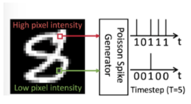
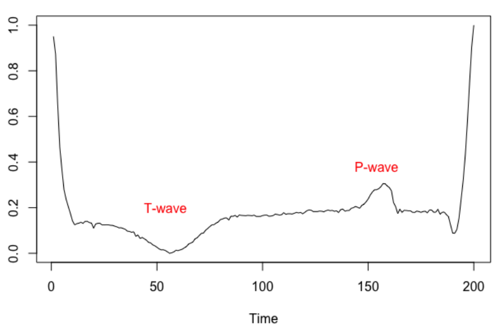
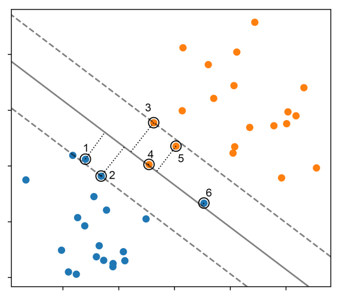

Hi, my name is Timi! My interests lie in the intersection of AI and Data Science and I love building applications (e.g. ways to build robust [RAG](https://www.promptingguide.ai/techniques/rag) architectures) and exploring ways to utilise the latest advancements in the field in a practical way. Academically, I completed my MSc. in Statistics, where I wrote my thesis on the <a href="https://timif2.github.io/AI Safety Thesis - Timi Folaranmi.pdf">adversarial robustness of Spiking Neural Networks</a>, intersecting AI Safety and neural networks.

[Email](timicsbe@gmail.com) / [GitHub](https://github.com/timif2) / <a href="https://timif2.github.io/Timi Folaranmi - CV - Sept2024.pdf">CV</a>

# Research and Papers

### Adversarial Robustness of Rate-Encoded Spiking Neural Networks

[Report](https://timif2.github.io/AI%20Safety%20Thesis%20-%20Timi%20Folaranmi.pdf) / [Code](https://github.com/timif2/snnthesis)

  
  

    As part of my Master's thesis, I wrote a technical report studying the resistance to adversarial attacks of rate-encoded Spiking Neural Networks (SNNs) across various white-box and black-box attacks. This study explores the robustness of SNNs in different adversarial scenarios and proposes methods to enhance their security and reliability.
  

### Modelling Heart Conditions and Train Delays Using Machine Learning Methods
*Alastair Harrison, **Timi Folaranmi**, Ying Zhan, Weiyun Wu* 

<a href="https://timif2.github.io/ECG -based classification and Train Delay Prediction using Machine Learning.pdf">Report</a> / <a href="https://timif2.github.io/Heart Conditions Study Slides.pdf">Presentation</a>

  
  

The first study looks at the question of: To what extent can heart conditions be predicted from ECG readings? The second study looks at a machine learning approach to predicting train delays, and conducting all analysis in R.
  

### An Exploration into Support Vector Machines (SVMs) with comparisons to other Classification Methods
*Jake Dorman, **Timi Folaranmi**, Anas Almhmadi, Rishabh Agarwal*

<a href="https://timif2.github.io/An Exploration into SVMs with comparisons to other classification methods.pdf">Report</a> / <a href="https://timif2.github.io/Support_Vector_Machines.pdf">Presentation</a>

  
  

A technical report on the background, performance and evaluation of Support Vector Machines in solving general classification problems (in Python), compared with other classification methods. 
  

# Learning Projects

## Neural Networks

### Sequence classification with LSTM Recurrent Neural Network, using Keras
[GitHub](https://github.com/timif2/neural-networks/blob/90e84800424fce0ff569115d7204b7344e84a045/Sequence%20Classification%20with%20LSTM%20Recurrent%20Neural%20Networks%20with%20Keras.ipynb)

Explored movie review sentiment classification problem using LSTM Recurrent Neural Network, with Keras.

### Classification using neural networks in PyTorch
[GitHub](https://github.com/timif2/neural-networks/blob/9489a21a391af28e1dd75296ffc92612906e7a10/Neural%20Network%20(Multi%20-%20class)%20Classification%20in%20PyTorch.ipynb)

Neural network for basic multi - class classification. 

## Computer Vision

### Vision Transformer (ViT) from scratch in PyTorch
[GitHub](https://github.com/timif2/computer-vision/blob/bed7418b0a8a61bc8b31797573696afd6f055b51/Vision%20Transformer%20(ViT)%20from%20scratch%20in%20PyTorch%20(Paper%20Implementation).ipynb)

A paper implementation of the (original) [Vision Transformer (ViT)](https://arxiv.org/abs/2010.11929) architecture using PyTorch. Applies convolutional neural network (CNN) method. It follows from code by [Daniel Bourke](https://github.com/mrdbourke/pytorch-deep-learning/)

## Natural Language Processing

### Text Summarisation, using NLP
[GitHub](https://github.com/timif2/language-models/blob/b61241d7cc7343ef5a2e1c358ce663a01c4785cb/Text%20Summarisation%20using%20Natural%20Language%20Processing.ipynb)

A project exploring text summarisation, applying tokenisation and extraction method.

## Recommendation Systems

### Collaborative Filtering system
[GitHub](https://github.com/timif2/recommendation-systems/blob/1fee42d5c8305d58d31c5993037980a3a8bc509e/Collaborative_filtering.ipynb)

Implementation of a collaborative filtering (CF) based system looking at user - based and item based CF and Alternating Least Squares (ALS) on a restaurant problem.

## Paper Implementations

I tend to learn better when trying to apply concepts from papers. Below are some basic paper implementations directly using [labml](https://github.com/labmlai) and most of their implementation code:

### Generative Adversarial Networks (GANs) implementation using PyTorch
[GitHub](https://github.com/timif2/paper-implementations/blob/f94bfe42c01132bd3303eeee7e0143e7e8a14572/Generative%20Adversarial%20Network%20(GAN)%20with%20PyTorch.ipynb)

### Vision Transformer (ViT) implementation
[GitHub](https://github.com/timif2/paper-implementations/blob/f94bfe42c01132bd3303eeee7e0143e7e8a14572/Vision%20Transformer%20(ViT)%20using%20PyTorch.ipynb)

